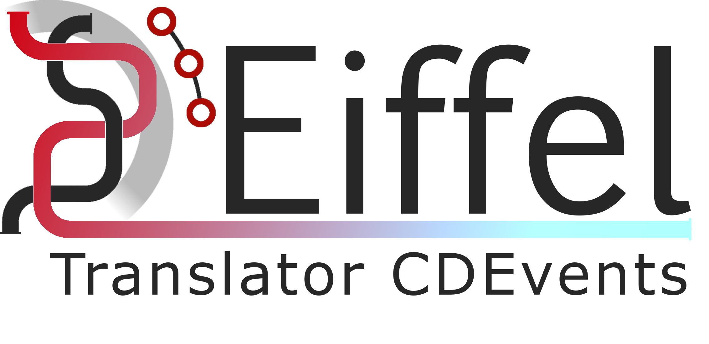

<!---
   Copyright [yyyy] [name of copyright owner]
   For a full list of individual contributors, please see the commit history.

   Licensed under the Apache License, Version 2.0 (the "License");
   you may not use this file except in compliance with the License.
   You may obtain a copy of the License at

       http://www.apache.org/licenses/LICENSE-2.0

   Unless required by applicable law or agreed to in writing, software
   distributed under the License is distributed on an "AS IS" BASIS,
   WITHOUT WARRANTIES OR CONDITIONS OF ANY KIND, either express or implied.
   See the License for the specific language governing permissions and
   limitations under the License.
--->



[](https://github.com/eiffel-community/community/blob/master/PROJECT_LIFECYCLE.md#stage-sandbox)

# Eiffel Translator CDEvents
A translator for events between the Eiffel event protocol and the CDEvents protocol.

[CDEvents](https://cdevents.dev/) builds upon [CloudEvents](https://cloudevents.io/) and listens on HTTP bindings.

**Translate CDEvents to Eiffel events:**
- The translator API `(http://<eiffel-translator-cdevents-host:port>/translate/eiffel)` needs to be subscribed with the specific CloudEvents broker to receive the CDEvents of different types.
- When this translator `(/translate/eiffel)` receives a CDEvent from configured CloudEvents broker `(cloudevent.broker.url)`, the CDEvent will be translated to a mapped Eiffel event and send to the RabbitMQ message broker through configured RemRemPublish URL (`remrem.publish.url`).

**Translate Eiffel events to CDEvents:**
- This translator is implemented with an [AMQP RabbitMQ listener](https://spring.io/guides/gs/messaging-rabbitmq/), which receives the Eiffel events from configured Rabbit MQ host `(rabbitmq.host)` and exchange`(rabbitmq.exchange)` with specific routing filters configured (`rabbitmq.routingkey`)
- When this translator receives an Eiffel event, the Eiffel event will be translated to a mapped CDEvent and send to the configured CloudEvents broker `(cloudevent.broker.url)`

## Code of Conduct and Contributing
To get involved, please see [Code of Conduct](https://github.com/eiffel-community/.github/blob/master/CODE_OF_CONDUCT.md) and [contribution guidelines](https://github.com/eiffel-community/.github/blob/master/CONTRIBUTING.md).

Note that these files are located in the .github repository. See [this](https://docs.github.com/en/github/building-a-strong-community/creating-a-default-community-health-file) page for further details regarding default community health files.

## About this repository
The contents of this repository are licensed under the [Apache License 2.0](./LICENSE).

## About Eiffel
This repository forms part of the Eiffel Community. Eiffel is a protocol for technology agnostic machine-to-machine communication in continuous integration and delivery pipelines, aimed at securing scalability, flexibility and traceability. Eiffel is based on the concept of decentralized real time messaging, both to drive the continuous integration and delivery system and to document it.

Visit [Eiffel Community](https://eiffel-community.github.io) to get started and get involved.

## How to Run

Configure RabbitMQ, CloudEvents broker and Eiffel REMReM Publish URLs in the [application.properties](https://github.com/eiffel-community/eiffel-translator-cdevents/blob/master/src/main/resources/application.properties)

```
#RabbitMQ host details
rabbitmq.host=127.0.0.1
rabbitmq.username=myuser
rabbitmq.password=myuser
rabbitmq.exchange=ei-poc-4
rabbitmq.routingkey=#

#CloudEvent broker
cloudevent.broker.url=http://127.0.0.1:8090/default/events-broker

#Eiffel-remrem-publish
remrem.publish.url=http://127.0.0.1:8096/generateAndPublish
```

Go to the root directory of the Eiffel Translator CDEvents source and run the Spring boot command

```
./mvnw spring-boot:run
```

The Eiffel Translator CDEvents application boots up with connecting to RabbitMQ on port 5672 and declaring RabbitMQ Queue for receiving Eiffel messages.

The Eiffel Translator CDEvents application will be running and accessible on http://127.0.0.1:8080/translate/

Now the endpoint URL `http://127.0.0.1:8080/translate/eiffel`  can be subscribed with CloudEvents broker to receive CDEvents

The Eiffel Translator CDEvents application can be run on Docker container with the below commands from the root directory
```
./mvnw spring-boot:build-image -Dspring-boot.build-image.imageName=eiffel/eiffel-translator-cdevents

docker run -d -p 8080:8080 -t eiffel/eiffel-translator-cdevents
```

Check [Eiffel CDEvents mapping](./eiffel-cdevents-mapping.md) to know how different Eiffel events map to CDEvents